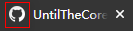

# 基础入门

## 安装

:::: code-group
::: code-group-item yarn

```bash
# 安装
yarn global add vuepress 

# 新建一个 markdown 文件
echo '# Hello VuePress!' > README.md

# 开始写作
vuepress dev .

# 构建静态文件
vuepress build .
```

:::
::: code-group-item npm

```bash
# 安装
npm install -g vuepress 

# 新建一个 markdown 文件
echo '# Hello VuePress!' > README.md

# 开始写作
vuepress dev .

# 构建静态文件
vuepress build .
```

:::
::::

[官方的入门安装教程](https://v2.vuepress.vuejs.org/zh/guide/getting-started.html)
还是挺清晰的，可以直接参照，如果本身就对前端开发熟悉的，基本无门槛即可快速搞定！（注：config配置文件，既然使用v2了，建议使用ts，官方原生支持，无需额外配置，且有更好的类型提示。)

由于v2版还处于beta，官方的文档还有点不够完善，如果你是第一次使用Vuepress且直接上手v2，那么我建议在安装完成后先大概通读一遍两个版本各自的指南( [v1的指南](https://vuepress.vuejs.org/zh/guide/getting-started.html) [v2的指南](https://v2.vuepress.vuejs.org/zh/guide/getting-started.html) )
。如果你本身就是v1使用者，直接看[官方的迁移指南](https://v2.vuepress.vuejs.org/zh/guide/migration.html)即可。

现在上网搜索出来的资料几乎都是关于v1的内容，新手刚开始配置的时候直接使用v1的配置套在v2上，会因为配置属性的变更而失败。所以新手在手动配置自己需要的内容前，建议也是去过一遍迁移指南，看看是否是因为属性更新引发的问题，这个坑，我是踩过了:
grinning:。

## 首页

看到别人的站点，有网站首页，有基础介绍，有按钮等，为啥自己的按照官方指南就没有这个页面呢？那是因为关于首页的配置是需要在`根级README.md`文件内配置的，需要配置`YAML front matter`指定`home:true`。

在初期，完全不用关心这个语言要怎么写，只需要按照官方给的 [默认主题的配置文件](https://vuepress.vuejs.org/zh/theme/default-theme-config.html#%E9%A6%96%E9%A1%B5)
配置即可。略坑的是，这份配置介绍v2文档没有，要是只看v2的小伙伴，就一头雾水了。下面，我先贴出v1和v2两个版本的首页配置，按需复制即可！

:::: code-group

::: code-group-item v2

```yaml
---
home: true
heroImage: /hero.png
heroText: Hero 标题
tagline: Hero 副标题
actions:
  - text: 进入主页 →
    link: /home/
    type: primary
features:
  - title: 简洁至上
      details: 使用最简单清晰的话语编写博客。
  - title: 注重逻辑
      details: 知识点衔接紧密,注释明白,逻辑清楚。
  - title: 兴趣驱动
    details: 丰富的代码案例,页面效果驱动学习。
footer: Copyright © 2021-present untilthecore | Power by Vuepress 2.x
---
```

:::

::: code-group-item v1

```yaml
---
home: true
heroImage: /hero.png
heroText: Hero 标题
tagline: Hero 副标题
actionText: 快速上手 →
actionLink: /zh/guide/
features:
  - title: 简洁至上
    details: 以 Markdown 为中心的项目结构，以最少的配置帮助你专注于写作。
  - title: Vue驱动
    details: 享受 Vue + webpack 的开发体验，在 Markdown 中使用 Vue 组件，同时可以使用 Vue 来开发自定义主题。
  - title: 高性能
    details: VuePress 为每个页面预渲染生成静态的 HTML，同时在页面被加载的时候，将作为 SPA 运行。
footer: MIT Licensed | Copyright © 2018-present Evan You
---
```

:::
::::

细心的你肯定注意到，主要的内容都没有大的变动，主要是按钮的配置进行了改进，v2支持[多按钮的配置](https://v2.vuepress.vuejs.org/zh/reference/default-theme/frontmatter.html#actions)。关键配置属性为`actions`
,关于首页的配置属性在[v1](https://vuepress.vuejs.org/zh/theme/default-theme-config.html#%E9%A6%96%E9%A1%B5)
版本上并未做更多详细的解释，而在[v2](https://v2.vuepress.vuejs.org/zh/reference/default-theme/frontmatter.html#%E6%89%80%E6%9C%89%E9%A1%B5%E9%9D%A2)
中的解释是比较详细明了的。

## 静态资源

官方的关于静态资源的介绍：[v1版](https://vuepress.vuejs.org/zh/guide/assets.html)、[v2版](https://v2.vuepress.vuejs.org/zh/guide/assets.html)

官方建议单文件内的静态资源文件使用相对文件路径来引入，也就是说，这些静态文件和`.md` 文件放在一起或就近存放。但是被依赖的全局文件，则需要放在`/docs/.vuepress/public/` 目录下。

::: tip 虽然现在的内容还不涉及更多的文件目录，但是我依然建议你可以暂停两分钟看一下官方对于目录的约定(这段概括性内容当前只有v1有)
，让自己提前知道一下哪些目录能做什么。另外，读完v1的目录介绍，你还应继续看一下[v2对这些内容产生了哪些变更](https://v2.vuepress.vuejs.org/zh/guide/migration.html#%E7%BA%A6%E5%AE%9A%E6%96%87%E4%BB%B6%E5%8F%98%E6%9B%B4)
:::

### favicon

完成首页部分内容的搭建后，我们先给自己的网站设置个性化的`favicon`。它就是平时打开网页时，网页标签栏左边的小图标

首先需要在静态资源目录中创建一个存放图片的`images` 目录(`/docs/.vuepress/public/images/`),然后将`favicon.ico`文件放入，当然，你也可以用`.png` 格式的文件作为favicon。

图标文件添加完成后，则继续回到config配置文件，配置站点的head属性：

```ts
export default defineUserConfig<DefaultThemeOptions>({
  title: "untilthecore's blog",
  description: "欢迎访问 untilthecore 的个人博客",
  head: [
    ["link", {rel: "icon", href: "/images/favicon.ico"}],
  ],
});
```

注意：不要把`public` 也写进来了。

::: tip 对config文件的修改需要重启项目生效，1次不成，那就2次！重启后ctrl+f5刷新。
:::

## 导航栏(navbar)

官方对于导航栏的介绍：[v1版](https://vuepress.vuejs.org/zh/theme/default-theme-config.html#%E5%AF%BC%E8%88%AA%E6%A0%8F)、[v2版](https://v2.vuepress.vuejs.org/zh/reference/default-theme/config.html#navbar)

navbar是 v1 -> v2 大改的属性，在v1中是控制全局导航栏的显示，而且`nav` 才是v1中配置导航栏的属性。而在v2中，都用`navbar` 来控制和配置了。

官方的文档已经介绍的非常详细了，这里不再赘述。但其中一些需要注意的点需要说一下：

### 1.优化配置文件

不将navbar的配置都写到`config.ts` 文件中，当整站内容庞大后，维护和查看将异常困难。

可以将`navbar` 内容拆出来，用一个文件单独管理，且和config.ts文件同级，它再作为所有需要导航栏配置的页面管理页面，目录结构如下：

```text
├─ /
│  ├─ docs
│  │   ├─ .vuepress
│  │   ├─ config.ts
│  │   └─ navbar.ts     # 管理 apple/navbar.ts 和 banner/navbar.ts
│  ├─ apple
│  │   └─ navbar.ts
│  ├─ banner
│  │   └─ navbar.ts
```

假如有apple目录和banner目录内容要放到导航上被快速访问，而且它们各自含有较多子项，那么就将各自的导航配置数据在各自目录下完成。

示例：

```ts
// apple/navbar.tsG
import type {NavbarGroup} from "@vuepress/theme-default";

const nav: NavbarGroup = {
  // 导航栏上显示的文字内容
  text: "apple",
  // 子项
  children: [
    {
      // 子分组的小标题
      text: "apple",
      // 具体的子项
      children: [
        {
          text: "apple1",
          link: "/apple/apple1/apple1-1/"
        },
        {
          text: "apple2",
          link: "/apple/apple2/apple2-1/"
        },
        {
          text: "apple3",
          link: "/apple/apple3/apple3-1/"
        },
      ]
    },
  ]
};

export default nav;
```

在`/docs/.vuepress/navbar.ts` 文件中引入`/apple/navbar.ts`，并将引入集合导出，提供给`config.ts => navbar`使用。

```ts
// docs/.vuepress/navbar.ts 

import type {NavbarConfig} from "@vuepress/theme-default";
import appleNavBar from '../apple/navbar'

const nav: NavbarConfig = [
  appleNavBar,
];

export default nav;

```

```ts
// docs/.vuepress/config.ts
import {defineUserConfig} from "vuepress";
import type {DefaultThemeOptions} from "vuepress";
import navbar from "./navbar";

export default defineUserConfig<DefaultThemeOptions>({
  lang: "zh-CN",
  title: "untilthecore's blog",
  description: "欢迎访问 untilthecore 的个人博客",
  head: [
    ["link", {rel: "icon", href: "/images/favicon.ico"}],
  ],

  themeConfig: {
    navbar,
  },
});

```

### 2.使用斜杠结尾

使用官方的例子并沿用同样的方式写`link` 是不会有任何问题的，但是如果不以`/` 结尾，会造成页面的`sidebar` 路径匹配错误，你会发现从导航栏点过进页面没有侧边栏，但是刷新后又出现了，这是因为刷新后在链接结尾自动添加上了`/` 。

`link` 内是目录顺序，比如`/apple/apple1/apple1-1/`，apple、apple1、apple1-1都是目录，但页面的访问会被vuepress默认指向apple1-1下`README.md` 文件，所以如果没有这个文件，就404了。如果你想指定特定的页面也是可以的，比如将`link`写成这样`/apple/apple1/apple1-1/hello.md`

## 侧边栏(sidebar)

官方对于侧边栏的介绍：[v1版](https://vuepress.vuejs.org/zh/theme/default-theme-config.html#%E4%BE%A7%E8%BE%B9%E6%A0%8F)、[v2版](https://v2.vuepress.vuejs.org/zh/reference/default-theme/config.html#sidebar)

侧边栏的配置这里就不过多介绍了，阅读官方文档即可。侧边栏基本需要注意的内容同导航栏，但也有一个需要额外需要知道的地方。

初次使用的小伙伴会发现别人的侧边栏是不同页面不同侧边栏，为啥自己的就只有全局侧边栏，而且就算用了官方的（v2）示例2会变成其相关子页面都是统一侧边栏。那么想要一个页面就有一个单独的侧边栏怎么做呢？非常简单，把需要生成独立侧边栏的页面单独配置它的`sidebar`

```ts
// docs/.vuepress/sidebar.ts
import type {SidebarConfig} from '@vuepress/theme-default';
import WebVueSideBar from '../web/vue/sidebar';
import WebReactSideBar from '../web/react/sidebar';

const s: SidebarConfig = {
  '/web/vue/': WebVueSideBar,
  '/web/react/': WebReactSideBar,
};

export default s;

```

```ts
// web/vue/sidebar.ts
import type {SidebarConfigArray} from "@vuepress/theme-default";

const sidebar: SidebarConfigArray = [
  {
    text: "Vue系列",
    children: [
      {
        text: "Vue2",
        link: '/web/vue/vue2/',
        children: [
          {
            text: 'vue2基础',
            link: '/web/vue/vue2/vue2.md'
          }
        ]
      },
      {
        text: "Vue3",
        link: "/web/vue/vue3/",
        children: [
          {
            text: 'vue3基础',
            link: '/web/vue/vue3/vue3.md'
          }
        ]
      },
      {
        text: "Vuepress",
        link: "/web/vue/vuepress/"
      },
    ]
  },
];

export default sidebar;
```

上述代码示例表示整个`/web/vue/` 目录下的所有页面侧边栏都渲染为`web/vue/sidebar.ts` 内的数据。如果想实现具体页面独立侧边栏，那么需要把属性对象的字符串路径写全，就是这个`'/web/vue/': WebVueSideBar,`，把前面路径写全。

另外，我非常建议文件路径也写完整路径，即`/web/vue/vue2/vue2.md`这样的全路径。这样可以避免因为相对路径而发生的侧边栏文件路径匹配错误问题。

::: tip
注意：侧边栏生成时，是以页面的标题来生成的。不要以为侧边栏配置文件里写的是什么侧边栏就是什么。
:::

::: warning
配置新侧边栏的路径中不能有中文，否则无法正常渲染侧边栏！
:::

### 自动生成侧边栏插件

当页面多起来后，你还会发现一个问题，那就是手写侧边栏太麻烦了，好在有社区大佬解放了我们的双手，开发了一个自动生成侧边栏的插件[vuepress-plugin-auto-sidebar](https://www.npmjs.com/package/vuepress-plugin-auto-sidebar)。

安装：

:::: code-group
::: code-group-item v1

```bash
$ npm i vuepress-plugin-auto-sidebar -D

$ yarn add vuepress-plugin-auto-sidebar -D
```

:::

::: code-group-item v2

```bash
$ npm i vuepress-plugin-auto-sidebar@alpha -D

$ yarn add vuepress-plugin-auto-sidebar@alpha -D
```

:::

::::

[插件使用文档](https://shanyuhai123.github.io/vuepress-plugin-auto-sidebar/zh/features/plugin-options.html#%E6%A6%82%E8%A7%88)

这个插件还可以帮助自动生成navbar，但暂时只支持v1。

注：还记得上面说的建议`link`的值写全路径的吗？已经使用这个插件的你可能已经发现这个插件默认只生成了一级目录和对应目录下的文件的侧边栏数据，而且文件路径使用的是相对路径。如果需求就只是使用一级目录和里面的文件，那么用它非常合适，但是如果想要实现这样的有二级目录结构的内容，就显得捉襟见肘了：

```javascript
module.exports = {
  '/aa/bb/': [
    {
      'text': 'bb',
      'title': 'bb',
      'collapsable': true,
      'sidebarDepth': 2,
      'children': [
        '/aa/bb/README.md',
        '/aa/bb/ab.md',
        {
          text: 'c',
          title: 'c',
          collapsable: true,
          'sidebarDepth': 2,
          children: [
            // '/aa/bb/cc/README.md', // 如果想让 cc 可以被点击，则创建 cc/README.md 文件
            '/aa/bb/cc/abc.md',
          ]
        }
      ]
    },
  ],
}
```

总的来说，此插件的能力还是有待扩展的，期待作者后续的更新。有能力可以自己fork下来增强或提PR哦!

## 部署

1. Vuepress 的 `最近更新` 的日期功能是通过 git 提交日志来生成的，若是本地打包并将 `dist` 目录上传则无需日期错误的问题。但若是通过 `CI/CD` 工具，比如 `Github Action` 则需要在 `workflows -> *.yml` 文件中配置将提交记录先拉取下来后再进行打包，否则所有文件的日期都只显示最新打包的日期！

## 小结

完成以上的操作，一个纯内容型的博客站点就搭建好了。其他更多的内容就是给整站添砖加瓦，使展示效果更丰富，使用体验更友好！
